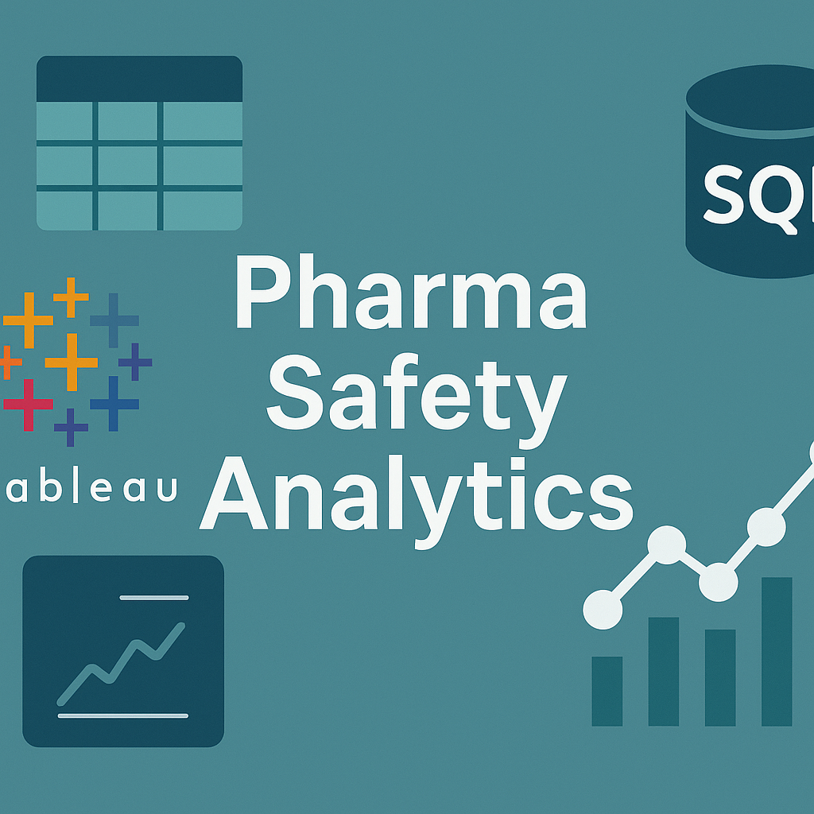

# 💊 Pharma Drug Utilization & Safety Analysis (SQL + Tableau)

This project explores **drug utilization**, **prescription patterns**, and **adverse event safety reporting** in a synthetic healthcare dataset, using **MySQL** and **Tableau Public**.

---

## 📌 Project Goals

- Analyze patient demographics, prescriptions, and adverse events.
- Build advanced SQL queries with **joins**, **CTEs**, **subqueries**, and **window functions**.
- Create a visual dashboard using **Tableau** to highlight drug safety trends.

---

## 🗂️ Contents

| Folder | Description |
|--------|-------------|
| `/data` | Synthetic CSV datasets |
| `/schema` | SQL script to create database tables |
| `/queries` | SQL queries for insights and analysis |
| `/dashboard` | Tableau dashboard and exported figures |

---

## 🧪 Dataset Overview

Synthetic data includes:

- `patients.csv` – Demographics & region
- `prescriptions.csv` – Drug usage patterns
- `drugs.csv` – Drug metadata
- `adverse_events.csv` – Safety & outcomes
- `regions.csv` – Geographic codes

All data is **synthetic** and created for educational purposes.

---

## ⚙️ Setup Instructions

### 🔸 MySQL Setup

1. Create the database:

`sql
CREATE DATABASE pharma_db;
USE pharma_db;

2. Run the table schema from schema/create_tables.sql.

3. Import CSVs into each table using MySQL Workbench or CLI.

🔸 Tableau
1. Open dashboard/tableau_dashboard.twb in Tableau Public Desktop.

2. Load the CSVs as data sources.

3. Explore the multi-sheet dashboard showing drug usage and safety.

📊 Key Insights & Visuals

| Analysis                    | Tool          | Output                          |
| --------------------------- | ------------- | ------------------------------- |
| Total prescriptions by drug | SQL           | CTE + aggregate                 |
| Adverse events by severity  | Tableau       | Bar chart                       |
| Drug safety ranking         | SQL + Tableau | Window function + visualization |
| Demographics by region      | Tableau       | Map & pie chart                 |
| Prescription timelines      | Tableau       | Time-series chart               |
| Patient safety summary      | SQL View      | `patient_safety_summary`        |
## 📌 Example SQL Highlights

### Adverse event count per drug (Top 5)

```sql
SELECT d.drug_name, COUNT(a.event_id) AS event_count
FROM drugs d
JOIN adverse_events a ON d.drug_id = a.drug_id
GROUP BY d.drug_name
ORDER BY event_count DESC
LIMIT 5;
```

### Drug safety ranking using CTE and window function

```sql
WITH adverse_counts AS (
  SELECT drug_id, COUNT(*) AS adverse_event_count
  FROM adverse_events
  GROUP BY drug_id
)
SELECT d.drug_name, a.adverse_event_count,
       RANK() OVER (ORDER BY a.adverse_event_count DESC) AS safety_rank
FROM adverse_counts a
JOIN drugs d ON a.drug_id = d.drug_id;
```

📈 Dashboard Preview
💡 Includes:
- Drug usage trends
- Adverse events by severity and drug
- Patient demographics
- Prescriptions timeline

🚀 Skills Demonstrated
- Relational database design (MySQL)
- Complex SQL queries (JOINs, CTEs, Window Functions)
- Data analysis & storytelling
- Data visualization with Tableau
- Real-world project documentation

## Contributing
Contributions are welcome! Please open issues or submit pull requests for improvements, new features, or bug fixes.

## Contact

For questions, support, or collaboration inquiries, please contact:

**Carlos Montefusco**  
Email: cmontefusco@gmail.com 
GitHub: [camontefusco](https://github.com/camontefusco)
